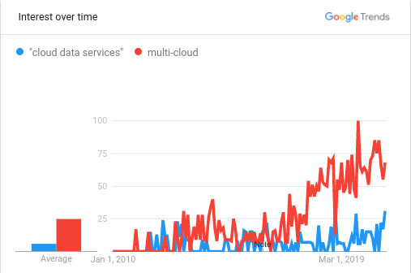

*The photo above is from 2011 post on Twitter via Instagram (I think?). At the time, I was commenting that Cloud was now being used in conversations the way Broadband was back in 2000.*

# So, a quick couple of updates...

This will be and final blog post for 2020. 

My [last day at Dell Technologies](https://fudge.org/my-tenth-year-at-dell-technologies) was on the 4 year anniversary of [the Dell EMC combination](https://fudge.org/my-sixth-year-at-vce-and-my-sixth-week-at-dell-emc). When I shared updates on LinkedIn it was awesome to have folks virtually drop by to leave a like, comment, or Calendly request to catch up by Zoom in these social gesture distancing times.

So, I'm super pumped to share I've joined [Faction](https://factioninc.com) in a servant leader role. 

In fact, I shared this update on Twitter a few weeks ago.

<blockquote class="twitter-tweet" data-dnt="true">
So, a quick couple of updates...  1) I&#39;ve joined <a href="https://twitter.com/FactionInc?ref_src=twsrc%5Etfw">@FactionInc</a> 🤓☁️☁️☁️☁️☁️ 2) Yes. We&#39;re hiring. 🚀☁️☁️☁️☁️☁️<a href="https://t.co/jvdhiuFhRD">https://t.co/jvdhiuFhRD</a>
&mdash; Jay Cuthrell (@JayCuthrell) <a href="https://twitter.com/JayCuthrell/status/1338707786738393093?ref_src=twsrc%5Etfw">December 15, 2020</a></blockquote> 

Oh. Did I mention [we're hiring](https://www.factioninc.com/about/careers/) too? 

# Timing

It's an interesting time in the IT industry. Specifically, there is roughly a decade of transformation that has taken place since Gartner coined the Nexus of Forces that drove adoption of Private Cloud, Public Cloud, and Hybrid Cloud. 

Looking ahead, it is clear that there are going to be requirements for business realities that drive the need for Multi-Cloud options for a growing number of organizations. The timing is right to look back at how [Gartner's Business Analytics Framework sought to inform BI competency center (BICC) stakeholders globally (G00219420)](https://www.gartner.com/imagesrv/summits/docs/na/business-intelligence/gartners_business_analytics__219420.pdf) almost a decade ago.

Oh. Did I mention [we're hiring](https://www.factioninc.com/about/careers/) too? 

# Cloud Data Services

Cloud Data Services is a category to describe the common elements associated with managed delivery of data services that exist across a continuous spectrum from Private Cloud to IaaS / PaaS / FaaS / SaaS within Pubic Cloud as well as Hybrid Cloud. In short, Cloud Data Services is about the most advantageous placement of the data in a modern cloud consumption model. 

In approaching Cloud Data Services for Multi-Cloud, the permission space for unlocking innovation can encompass taking advantage of various services from more than one Cloud Service Provider. So, by taking a Multi-Cloud approach there can be a balance of capability and availability that confers greater resiliency and ease of migration that is commensurate with timelines, demands, and economic envelope of the business.

Because of my prior access to Dell Technologies Executive Briefings and awareness of Dell Technologies Capital [portfolio](https://www.delltechnologiescapital.com/portfolio/) updates, [Faction](https://factioninc.com) had been [on my radar](https://www.crunchbase.com/organization/faction) for a while. I've also been paying special attention to Cloud Data Services and Multi-Cloud requirements along the way.

It has becoming increasingly clear that organizations will demand Multi-Cloud options in 2021 as these same (and many new!) BICC stakeholders engage in continuous integrations that align business and essential information to build capabilities for digital transformation related outcomes through increased use of Cloud Data Services.

Luckily, [Faction](https://factioninc.com) has built a Cloud Data Services for Multi-Cloud practice over the years backed by Cloud Control Volumes™ (CCV™) and Hybrid Disaster Recovery-as-a-Service (HDRaaS) products enabled by [a growing number of patents](https://www.factioninc.com/patents/). So, I'm excited to help carry out the mission at [Faction](https://factioninc.com).

Oh. Did I mention [we're hiring](https://www.factioninc.com/about/careers/) too?