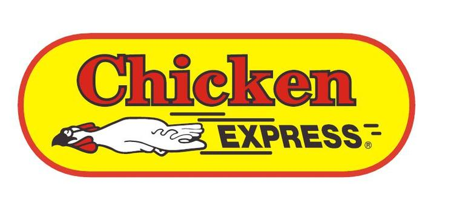

Time flies. This is a reflection on what I've learned since [my first day at Faction](/cloud-data-services-ahead).

Basically, in this post I wanted to capture some thoughts over the past 90 days. While I have more thoughts that are topical, I'll use this post to reflect on multicloud.

Also, I resisted publishing this on April 1st for all the obvious reasons.

# Multicloud Rosetta Stone Required

Cloud service providers are growing in number. So too are their product marketing teams that each try to make unique or differentiated claims about their portfolio.

My prior decade in converged infrastructure while creating private clouds taught me the value of deterministic power, weight, cooling, and geometry for a ease of datacenter deployment. In essence, for cloud service providers, direct connectivity is the next progression: (aspiration) deterministic latency.

Of course, there are only so many ways to uniquely describe or brand similar things like throughput. Yet, the naming continues to stay, mostly, on... brand.

Saying direct sounds exclusive because it is exclusive. Then again, sometimes there times when direct is not so direct and there are approaches such network-to-network interface (NNI) which can lower costs for an acceptably lower performance.

The NNI discussion is for another time. For now, I'd like to share some findings from March 2021 on what it means to be at the top tier.

# Packets Express

I've always been fasted by network connectivity. The higher the throughput the better, right?

Throughput could be thought of as simply the bandwidth (amount) and the latency (time) to fulfill a request. As such, words like express or fast would be likely modifiers in the marketing word soup.

By way of [poultry analogy](/the-5-ps-of-workloads), if PaaS was poultry as a service there would be the high latency drive through lane and then there would be, well, the express lane.

# Preferred Packet Pricing Pending

Speaking of marketing, the shorter the name the better, right? Well, a lot of ink can be spilled in trying to make poultry sound more interesting and the same applies to the delivery of packets over a network.

As an exercise, one can even arrange the various names for the top tiers of cloud service provider connectivity from shortest name to longest. So, even a simple ordering would look like this for private dedicated deterministically or even extremely low latency high bandwidth connectivity options:

* AWS Direct Connect
* IBM Cloud Direct Link
* Microsoft Azure ExpressRoute Direct
* Alibaba Cloud Express Connect
* Oracle Cloud Infrastructure FastConnect
* Google Cloud Platform Dedicated Interconnect

Naming is hard but that's four (4) references to connect and a tie for two (2) references to both express and direct. Now, let's boil them down a bit through another lens that is the inverse of how to name something in less than 45 characters.

In essence, these options are all marketed as the lowest latency, shortest path, and most highly performing connection to their service delivery location. However, the differences between them are many if you quickly review the documentation.

* [IBM](https://cloud.ibm.com/docs/dl)

  * Direct Link Dedicated offers up to 10 Gbps
  * Pricing for port charges can be $50,000 at the top unmetered tier or $1,800 at the top metered tier ($0.025 per GB)
  * Pricing for global routing is $2,500 at the top tier
* [Microsoft](https://docs.microsoft.com/en-in/azure/expressroute/)

  * ExpressRoute Direct offers up to 100 Gbps
  * Pricing for port charges start at $50,000 at the top tier 
  * Pricing for global routing is $10,000 at the top tier
* [Alibaba](https://www.alibabacloud.com/help/product/27782.htm)

  *
  *
* [AWS](https://docs.aws.amazon.com/directconnect/latest/UserGuide/Welcome.html)

  *
  *
* [Oracle](https://docs.oracle.com/en-us/iaas/Content/Network/Concepts/fastconnect.htm)

  *
  *
* [Google](https://cloud.google.com/network-connectivity/docs/interconnect)

  *
  *

# Final Thoughts

While I've been enjoying Netlify for hosting my blog, I am considering yet another migration to a free tier with one of the cloud service providers. This itch to migrate is a regular occurrence for me and not a reflection on Netlify.

Blogging these days will still be minimal or minor as I continue to put my efforts into documentations at the workplace. Perhaps I'll be able to change that in 2021 but it isn't a major focus.