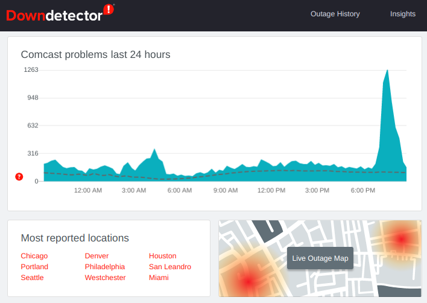

# DRAFT

The screenshot above is from a trip to Tokyo back in 2012. I had never experienced that kind of network performance back in the USA -- this was true 3G performance.

Fast forward to 2020. Now it's 5G making headlines and 6G futures are coming eventually if you subscribe to [futurecasting](https://www.ericsson.com/en/blog/2020/9/tech-trends-innovation-ericsson-research) from companies with an established history in telecommunications.

The inspiration for this post is derived from my last [10 years with Dell Technologies](/my-tenth-year-at-vce/), tweets since then, interaction with the [2030 Cloud community](https://at.the2030.cloud/about), and a series of Lunchclub.ai sessions while [thinking remotely](/thinking-remotely).

# What was social telecom in 2010?

Roughly a decade ago, I authored a blog post about what I referred to as [Social Telecom](/social-telecom/). In a nutshell, much of my world view and career had been shaped by telecommunications and I was reflecting on what I saw happening at SxSW Interactive, Film, and Music conferences.

For example, when I created my first [Twitter](/on-twitter/) account in 2007 it was clear to be that mashing up SMS and Web was going to be interesting. Look back fondly to when SMS short code 40404 was fun (and periodically unintentionally hilarious when folks sent things to it in error) and more reliable than 3G connectivity.

Indeed, [being part of Startup Weekend 3 Atlanta in 2009 with Justin and Clay was fun](https://justindawkins.com/2009/11/gomodo-helps-you-quickly-find-events-near-you/). Looking back, Twilio was a sponsor for multiple Startup Weekend events that year including the Atlanta team using the Twilio API that ultimately won. 

Good times. [Great community](https://www.flickr.com/photos/timdorr/albums/72157622805303294).

Back then, the web on mobile devices was slow by modern comparisons but it was, well, mobile. There were apps being created that revolved around the rapid growth of social media companies. 

Looking back, it's not shocking to see that I applied a lens of what was being developed in and around the consumer grade Internet experience from laptops to the latest generation of mobile devices. My perspectives were from a service provider point of view.

The key social telecom concepts in 2010:

* Decision systems
* Telemetry systems
* Trends analysis systems
* Out of Band feedback loops
* Symmetric connectivity
* Virtual networking
* Race to zero pricing
* Shifting value requirements
* SLA transparency

# What is social telecom today in 2020?

Well, for one thing, the original @ComcastCares Twitter use case of days gone by is almost universally accessible for major brands now. Engagement is now table stakes. Slipping into the DM of a major brand on Twitter is even encouraged when there are service issues requiring a back channel alternative to calling a toll free support number.

Services such as [Downdetector](https://downdetector.com/) that launched in 2012 with a few dozen performance graphs now provide SLA transparency for over 1000 services from broadband providers to essential SaaS companies.

Today, solutions from SaaS vendors that fuse CRM, social platform conduits, sentiment analysis, and more are featured prominently as brands seek out every possible channel to engage more deeply with customers, subscribers, and users of products and services.

Successful companies that embody the social telecom concepts have SREs, design for fail, design for flail, and are oriented towards isolation of the signals that feed into learning systems that fortify services, lower operational costs, and generally improve year over year.

# What is social telecom going to be in 2030?

This part should probably start with another question. Luckily, the [2030 Cloud community](https://at.the2030.cloud/about) asked the following: 

> In 2030, will own the cloud?

My answer was similar to an answer I've provided before but I was far too optimistic. It goes like this...

Cloud will be an algal bloom of diversified service providers aligned to balkanized geopolitical boundaries terrestrially and a growing number of solar system federated systems of placement.

My reasoning is that today's economics and not necessarily tomorrow's economics:

* 6G is incubating in the minds of marketplace leaders as their 5G rollouts and storytelling ramps towards assumed ubiquity.
* Friends and family plans will take on new meaning that are more social constructs than they are cleverly marketed billing construct today.
* There will be a precipitous drop in memory costs and the future of egregious egress fees for cloud hosting providers is going to shift from awkward to completely unjustifiable.
* Cloud egress fees are the 2020s version of long distance charges from the 1990s.
* Pressure on purely asymmetrical performing facilities based broadband providers will continue but only in the most competitive US markets. This pressure (combined with increased remote work use cases) will extend to CGNAT and likely push most US markets into IPv6 by 2030.
* Startups will iterate consumer accessible capabilities by combining intuitive UX/UI and "neural engine" filters with affordable devices to approximate the @Cisco @TelePresence wow factor circa 2011.

Okay, but what about the ET --- yes extraterrestrial -- riff?

During the rise of facilities based broadband deployment, “edging out” strategy workshops for protected rural ILECs within the US was commonplace. The fear was MSOs would add door hangers to foment turnover so turnabout was fair play. ET is going to be the new high ground competitor.

My $0.02 x 6: SpaceX Starlink (beta pricing) is...

1. Reasonable
2. Comparable to @ViasatInternet tiers
3. Going to force @HughesNet to reach its nadir / pivot
4. Challenging terrestrial facilities based broadband
5. Going to compete with Kuiper
6. Not yet a OneWeb metaphor

Meanwhile, there are shifting value requirements.

Avatars will become generated. The progression from Reddit AMA to Cameo PMA AMTSA (ask me to say anything) will be fascinating as the deep fakes technology is connected with likeness brand licensing for authorized automated markets for applied celebrity pantomime and dialog.

We will see companies previously branded as “software defined” or “intent based” across networking and storage that offer “telemetry, “watcher”, or “reporter” functionality. Marketing will pivot to emphasize an “observability” angle more than an underlying technology investment.

One of the key stories for 5G is vehicular communication networks that will usher in unique use cases.

Eventually, there will be a market for fully electric hermetically sealed living compartment sized vehicles. Just look at /r/priusdwellers to understand how minimalist nomadic lifestyles are connected to car culture through an overnight AC and generator combo on wheels.

If you follow hobbyist #RVLife #minimalism #DigitalNomads streams on social platforms, you'll immediately understand why an all-electric E-Transit from @Ford may fundamentally alter the future of remote work and potentially shape future census data and domicile law.

If you follow long haul trucking or have listened to stories around national dividends (aka universal basic income) to offset trucker unemployment, just keep in mind that self driving and augmented assisted driving trucks have been in operation for several years. By 2030 these systems and training models will have been greatly refined. Many of the legal and logistical obstacles will have been overcome as well.

All of these futurist outcomes will require that social telecom extend far ahead. So as the saying goes, it is a question of when not if. As such, 2030 seems like a good placeholder.

# Who will pay for this and how?

On a long enough timeline, we might one day become civil enough to @expensify our @soylent and be reimbursed through @coinbase where each transaction is rounded up to infuse a @gofundme surplus that augments grand projects outside the established norm of national dividends (aka universal basic income).

Flashback to when the Twitter "SUL" happened in 2009.
Years later, when Google+ was a thing, I remember becoming way to popular way too fast because I was added to a similar kind of list in 2011. Thankfully, Google+ went the way of Buzz / Wave / etc... but in 2020 [a clever content creator moment on TikTok can translate into influencer level payouts](https://www.npr.org/2020/10/11/922554253/tiktok-sensation-meet-the-idaho-potato-worker-who-sent-fleetwood-mac-sales-soari).

Now imagine TikTok grade influencer economics like those from Gibson's Idoru.

# What requires careful attention?

Technology is just the response to a perceived need. Here's a great old quote I've taped to the refrigerator to keep me grounded and cynical.

> “A DCGAN hyper-localized psyops campaign can travel half way around the world while the truth is putting on its shoes. -- Mark Twain"
> -- Michael Scott

AI/ML and taste squelch knobs will need to be present because the streams will be far beyond what we assume is useful or manually manageable. There is a low chance of success if SRE skills are required to simply pay attention to the news.

Content creation and the means of production will continue to reach wider and more inclusive audiences. Eternal September aside, we will have to think about what is experienced today that could be problematic in the future.

What's news? What's entertainment? Who is the arbiter of each?

In 2020 the pattern seems to be... an old pattern.

1. Monetize a podcast/channel/etc
2. Say/write/do something outrageous (troll)
3. Wait for it to be noticed by the outrage prone
4. Engage based on greatest amplification potential
5. Deep link for rage subscribes
6. PROFIT
7. :repeat:

Just consider this fun re-reading exercise.

1. Re-read the ["Perspectives on Harmful Speech Online"](https://cyber.harvard.edu/publications/2017/08/harmfulspeech).
2. Try to forget it was published in 2017.
3. Imagine this was published in 2023.
4. Imagine Internet balkanization in 2027.
5. Imagine if 2030 has learned no lessons from history.

My best advice is to revisit our assumptions of what constitutes the curriculum of 2030 to assume that STEM is not enough. Instead, we will need to aim for [ESTEEM = STEM + Ethics + Empathy](/esteem-stem-+-ethics-+-empathy).