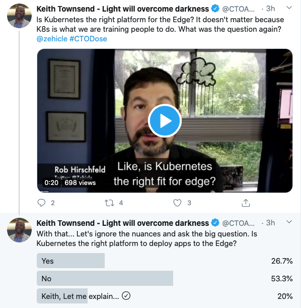

> THIS IS A WORKING DRAFT 

I've had a chance to think more about the past few months that for many might seem as though it has lasted for years not just months. This post is about thinking remotely.

First, I want to be clear that I'm incredibly *fortunate* and *privileged* to be able to even had the spare time to think let alone write this post. See also: It's easy for me to say this as a long time technology consultant that has spent the majority of my career in telecommunications as well as information and communications technology (ICT) being a "road warrior" operating far outside of traditional office settings.

Second, if you work with your hands making things or various service industries outside traditional office setting, I may not have much to share other than my respect and profound sympathy. So, if that sounds like you reading this -- thank you in advance.

Third, if you are reading this and fortunate enough to still have a job that *was in an office setting doing knowledge work*, the sudden shift to working away from the office is probably jarring. Patterns have changed and I'd like to share a few words about thinking remotely.

# Pattern Before

An incredibly simplified view of the pattern before might look like this:

* waking
* regular life
* commuting
* arrival at the office
* contributing in a formal office setting with cubicals, open seating, collaboration spaces, meeting rooms, break rooms, etc.
* departure from the office
* commuting
* regular life
* sleeping

In prior years, there were seemingly endless posts and articles describing how to live your best regular life. Those quality of life pieces might seem quaint or illogical at this present time.

# Pattern After

Likewise, an incredibly simplified view of the pattern after might look like this:

* waking
* *irregular* life
* contributing remotely most likely from a dedicated home office, spare room, spare table, couch, back seat of a vehicle, or other ad hoc setups never intended to be permanent, etc.
* *irregular* life
* sleeping

Once regular life went away it was replaced with *irregular* life. Even then, fitting some quality of life into the pattern is probably harder to fit in regardless.

# Thoughts for Today

In late March 2020, [a post from Sarah Emerson](https://www.techmeme.com/200307/p3#a200307p3) became the first of almost four dozen headlines to follow on the topic of ["remote work" on Techmeme](https://www.techmeme.com/search/d3results.jsp?q=%22remote+work%22&wm=false&start=48). 

Contrast this post to [March 2017 coverage of how IBM viewed remote work](https://www.techmeme.com/170322/p5#a170322p5) and pushed in a very different direction.

*So here we are in Semtember 2020.*

Typical company reactions might range from forming a team, panel, or formally assigning a leader to come up with a plan for getting remote work to, well, work. Or, if recent coverage provides an example, companies might look to established pioneers such like [GitLab as a type of management consultant for remote work](https://www.techmeme.com/200913/p7#a200913p7).

While I'm not advocating a dedicated [Head of Remote Work](https://www.washingtonpost.com/business/2020/09/09/head-of-remote-work-jobs/) needs to exist within the job family definitions of an human resources there will be a need to generalize the culture of remote work even more in the future. So, I'll focus on four key areas of thinking remotely: spaces, networks, sensing, and sustainability

## Adaptation and Improvisation

Let's take a look some ways to adapt to the current remote work realities and how improvising with tools and techniques that might help with the transition. From how we start our day to how to fill our day with both social and work interaction, there are several areas to consider different approaches.

### Waking moments

First, stop craving _Doom Scrolling_ sessions when you wake up and resist the tempation to grab your mobile device. Make a folder of apps called WAKE UP and put in the apps and services that make you feel good.

Second, your commute might be to the next room or to the table right beside your bed or even a couch or kitchen counter. It's okay to take your time. 

### Commute Times

The lack of a commute gives back, potentially, hours to work on a personal project or reading for the sake of reading. Use that time wisely.

If you were a commuter, it's not out of the ordinary to miss that commute either. So, consider taking your vehicle for spin around the block before you head into the home office.

### Lunch breaks

For lunch, why not try a [Zoom](https://zoom.us) group? While watching another bunch of humans eating and drinking over webcams on monitors might seem odd, consider that going to lunch with a group wasn't that uncommon before.

Are you a brownbag lunch type? Not a problem. Keep at it.

Were you a social lunch type? Consider a setup like a kitchen stand for your mobile phone (use WiFi) near where you would eat your lunch AWAY from your laptop. Don't be the person that dumps pasta all over the keyboard of your work laptop. :wink:

### Watercoolers

If you have access to a watercooler or a break room in the traditional good old days there has to be an equivalent or analogous option in the all remote or digital world. All work talk and no play talk makes for a dull day.

There are several options available thanks to the advent of ChatOps or other chat oriented operational tools.

- [Slack](https://slack.com) has promoted an _"IRC for muggles"_ friendlier way to stay connected that appeals to everyone from Sales to Engineering. 
  - There is a freemium version to get you and others hooked on the idea after attempting group chats with a finite scrolling history. 
  - Next, the paid options offer a durable history of chat complete with GIF meme insertion and WYSIWYG inputs and all of the richer Enterprise grade features with tiered pricing to match.
- [Microsoft Teams](https://www.microsoft.com/en-us/microsoft-365/microsoft-teams/group-chat-software) has all of the Enterprise features one would expect of a Microsoft product or service that appeals to the most common use cases or lowest common denominators.
  - For an Office 365 shop, this is probably the lowest cost option to explore.
  - Adoption and persistence of use will vary depending on the use of other Office 365 products and services -- YMMV.
- [Discord](https://discord.com) has a ways to go before there is a corporate or Enterprise ready feature set.
  - Being able to play music with voice channels is pretty much like the office radio of days gone by or even the overhead Spotify, Pandora, etc. playlist
  - Just keep in mind the primary audiences for the tool are gamers that needed gamer features.

No matter which one (or more) of these options are in use, the key to success is creating a channel that is meant for the watercooler, the random, the daily wtf, etc. These channels are meant to encourage whatever banter helps keep a healthy mix of work and play together in a commons just like the breakroom of olden days.

In addition, as some organizations are already highly global in nature, the use of ChatOps tools will help with some of the timely needs that asymmetric plain email use cannot address. As such, it is important to invest time in understanding the best ways to use the ChatOps tools in the same way you'd want to learn how to make more coffee in the machine when the last cup was poured.

### Sponsored Conference Lunches

The notion of a packed conference or trade event is shifting to digital approximations. The human to human networking was always the draw in most cases where a keynote or the highly over packed agendas and talk tracks prevented consuming all the sessions.

Just ask Keith Townsend aka [@CTOAdvisor](https://twitter.com/CTOAdvisor) about the digital approximations of virtual conferences. [He would know](https://www.usatoday.com/story/tech/2020/05/09/conferences-events-remain-virtual-after-covid-19/5172896002/).

One of my favorite parts of any event is the obligatory sponsored vendor lunch where you give up a badge scan for a free meal and are seated next to people you may not already know. Thankfully, there is [Lunchclub AI](https://lunchclub.ai/home) which facilitates one to one video meetings in a lunch style format.

While it might seem odd to seek out yet another video meeting these days, here is the draw of Lunchclub AI in a nutshell:

* Simulation of sponsored lunch tables at a conference
* Self-select “birds of a feather / special interests group”
* Easy G Suite Meet integration (but you can use Zoom as well) 

Using Lunchclub AI, I was able to have virtual lunch meetings with people from ViaSat, Exxon Mobil, Microsoft Azure, Sealed Air, KPMG, Jungle Disk, RelativityHQ, and WP Engine. The meetings took place over the course of a few weeks because eating 8 lunches back to back would be gluttonous. :wink:

If this sounds interesting, I've got a referral link you can use: <https://lunchclub.com/?invite_code=jayc11>

Referrals earn what are called *Clubpoints*. Yes yes yes. It's a *points system* or currency system of sorts. 

So far, I think the current (growth gaming design pattern) points system for Lunchclub AI works out as follows:

* Earn points for various actions that grow the platform userbase
* Spend points to 

  * essentially decline the wider AI in Lunchclub AI for narrower model 

    * you are allowed to pick a specialty you want to have lunch with
    * Again, sort of like picking up the tab for an exclusive lunch meeting)
  * get more meetings each week than your normal allowance

Oh. I just reached 30 points which is enough to pick up the tab for lunch with a speciality selection. :smile:

So, if you already have 30 Clubpoints perhaps you can [take me out for lunch](https://lunchclub.ai/member/8de0fd77776f) by gaming the specialty selections to conform to my profile attributes?

## Connectivity and Community

* VPN Use for Home and Mobile Broadband
* Virtual Resource Groups

## Presence and Partitions

The notion of presence in an office has recently shifted from sound of someone in a nearby cubical to the silence or invisibility of a geographically vague approximation. The familiar partitions of work and non-work as a balance can all too easily shift to unsustainable levels. So, let's explore a few concepts around the notion of status indicators.

### Status indicators

Status indicators are the best example of human driven edge computing. Wait. What?

Yes. 

I started thinking about this when [@CTOAdvisor aka Keith Townsend posted the following question on Twitter](https://twitter.com/CTOAdvisor/status/1308128609723449346):

Let me explain...

Edge computing is a marketing term used to describe doing your computing at the place closest to where the data is being generated.

I like using a backronym at this point because edge computing is older than the marketing term seeking to describe what it is.

*EDGE:*

* Endpoint
* Deployable
* Generally
* Event-driven

Confluence of hardware with just enough stack for remote sensing / telemetry / in-situ machine learning / AI feedback loops, etc. will push many Edge standards for use cases in Enterprise, service provider, and consumer segments. For example, you can set up a simple at home event trigger that updates your status or you elect to set your own boundaries. 

In the earliest days on the Interwebs, it was not uncommon to set up a webcam that pushed a JPG to a remote FTP site that was then embedded on a simple website as a type of virtual fish bowl. This was the ultimate real time presence indicator because you could see someone seated at their desk with a (typically) Connectix webcam displaying a grayscale 160x120 pixel or 320x240 pixel representation of their physical proximity to [a large CRT monitor](https://500ish.com/44-lbs-de7852628df0), keyboard, mouse... and probably a lot of empty soda cans.

So, for a modern twist why not consider a similar edge computing platform like that now? It's relatively simple to to set up a low cost IP camera with a PTZ control, upgrade the firmware with a [hacks style firmware](https://github.com/EliasKotlyar/Xiaomi-Dafang-Hacks), and [livestream to Twitch](https://gist.github.com/JayCuthrell/78dbeac6b7e5ea0f00e7f40c0a1a0f68) or similar streaming platforms.

### Out of Office automation

Example of throttling email OOO greeetings.

### Delayed delivery

Example of using delayed delivery in Office 365 and G Suite Gmail.

## Productivity and Balance

Now let's explore what it means to be productive and to achieve balance in a world that feels unbalanced.

### Tracking and taking vacation days

Know your state of residence laws and the studies that prove the point of time away from everything work related.

### Hard stops

Respect begins when the time investment of a meeting has a start and stop. Follow up items can literally be an extension to honor a stop.

### Owning your calendar

Discuss how advanced managing leaders maintain their calendars with examples like Pat from VMware.