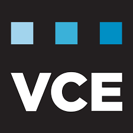

_"We eat change for breakfast, lunch, dinner, and snacks in between" -- VCE team ethos_

A year ago today was [my first day](/private-clouds-ahead/) at what would become VCE.

I'm looking back briefly because it is already time to look ahead. The past year has been about immersion in a deep sea of change at a company forging a culture -- and what I firmly believe is the way forward for an entire industry.

Without a doubt, my time so far at VCE has been marked by change. Change in names, titles, processes, methodologies... changing planes, changing rooms, changing cars... :wink:

But seriously, the majority of change fall into a category of continuous improvement. If you've ever read about or worked with minimum viable concepts or been around a startup you'll appreciate what I mean by _change_.

There are a lot of ways to track just how far things have come in the year I've been here. Many of the teams I've worked with here are veterans of VCE and prior. So, I keep reminding myself I've only been here for a year. Someone called me an 'old timer' this morning. Perhaps it is time to invest in some 'Just For Men' for my goatee?

Also, this blog has been talking about VCE for over a year now. What I blog about is less about the speeds, feeds, or anything that is related to what goes into a Vblock --- and more about what goes into VCE.

What goes into VCE is the best talent I've worked with in my career.

You know that saying about what it means if you are the smartest person in the room? (p.s. it means you are in the wrong room ) Well, in my estimation, I'm very much in the right room and at the right time.

As I write this post I'm in Dallas for a visit to VCE HQ. We've come a long way from the Pizza Hut where I showed up for my first day of training. You can't make this stuff up... It writes itself.

By this time tomorrow I'll be in Silicon Valley. I'm looking forward to attending the [Cloud Mafia Meetup](http://plancast.com/p/7679/cloud-mafia-meetup). Next week I'm really looking forward to seeing New Orleans when I get to speak at the [Cloud Services Summit](http://cloudsummit2011.com/).

And now... a subject near and dear to my heart...

**Wanted: Software Badasses**

Locally, I'm happy to see the VCE team in Research Triangle Park, NC growing and changing to reflect "where the puck is headed" for you hockey fans. So, I'll be signing off on this post by highlighting two local spots we're hiring for aggressively in software engineering: [Software Engineers](http://www.linkedin.com/jobs?viewJob=&jobId=1470398) and [Software QA Test Engineers](http://www.linkedin.com/jobs?viewJob=&jobId=2055889).  What will these folks be doing and working on exactly?

[Orchestration](http://chucksblog.emc.com/chucks_blog/2011/10/doing-more-with-less-vce-vblocks-and-uim-.html). [Orchestration](http://virtualgeek.typepad.com/virtual_geek/2011/10/chads-world-episode-9-is-live-heritage-auctions-vmaxe-isilon-lightning-and-more.html). [Orchestration](http://blogs.cisco.com/datacenter/vblock-accelerating-the-journey-to-private-cloud/). [Orchestration](http://virtualgeek.typepad.com/virtual_geek/2011/10/emc-unified-infrastructure-manager-uim-v30hello-world.html).

Orchestration software builds on ITIL best practices and disciplines, which define consistent, repeatable processes (or just-enough-ITIL if you like moderation in unicorns, rainbows, and lone wolves). It's nice to know what you did on Monday is something you can do again on Friday. It's even nicer knowing what you did was done to a level of satisfaction beyond a field in a database being toggled. It gets really amazing when you can tap against an API and get down and dirty on a command line AND have the option of ripping through a good enough GUI (or efficiently rolling your own).

Want to get your OAM&P/OSS/BSS on? Holler!

Orchestration is _far more_ than automating processes, adopting new management software, provisioning, configuration management, charge-back/billing, mediation, security, disaster recovery, operational support, and so on or making the transition to a lights out data center. You might say that orchestration is really what everything that you'd want to know is there and that most users assume already IS there. If your software developers and the stuff you use that comes from software developers is increasingly agile... it just makes sense to expect that [the depth](https://plus.google.com/112218872649456413744/posts/dfydM2Cnepe) it sits upon should be just as agile.

So again... check out the [Software Engineers](http://www.linkedin.com/jobs?viewJob=&jobId=1470398) and [Software QA Test Engineers](http://www.linkedin.com/jobs?viewJob=&jobId=2055889) listings and ping me if you have any questions or want to send your CV/resume over to jay.cuthrell at vce.com
